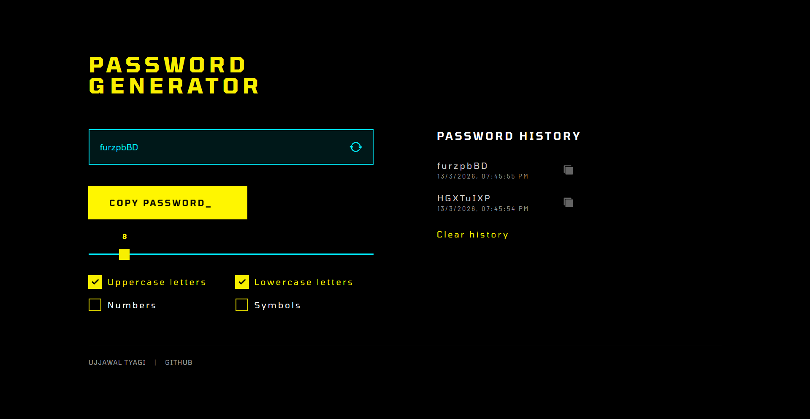

# ⚡ PASSWORD GENERATOR

A cyberpunk-themed, fully responsive password generator built with **React** + **Tailwind CSS**.


---

## ✨ Features

- 🔐 **Instant password generation** with customizable character sets
- 📏 **Adjustable length** via an animated slider (4–40 characters)
- 🔤 Toggle **Uppercase**, **Lowercase**, **Numbers**, and **Symbols**
- 📋 **One-click copy** with visual feedback
- 🕓 **Password history** — stores the last 5 generated passwords
- 📱 **Fully responsive** — works on mobile, tablet, and desktop

---

## 🚀 Getting Started

### Installation

```bash
# Clone the repository
git clone https://github.com/ujjwal149-droid/password-generator.git

# Navigate into the project
cd password-generator

# Install dependencies
npm install

# Start the dev server
npm run dev
```

Open [http://localhost:5173](http://localhost:5173) in your browser.

---

## 📷 Screenshots



## 🗂️ Project Structure

```
src/
├── components/
│   ├── Checkbox.jsx        # Animated custom checkbox
│   ├── Chip.jsx            # Copy password button
│   ├── PasswordInput.jsx   # Input field with animated refresh icon
│   ├── PasswordRecord.jsx  # Single history entry with copy feedback
│   └── Slider.jsx          # Range slider with floating value label
├── App.jsx                 # Main layout & password generation logic
├── App.css
└── index.css               # Global styles & custom typography
```

---

## 🧠 How It Works

1. Select your desired character types using the checkboxes
2. Set the password length using the slider
3. Click the **refresh icon** on the input to generate a new password
4. Click **COPY PASSWORD** to copy it to your clipboard
5. Previously generated passwords appear in the **Password History** panel
6. Click the copy icon next to any history entry to re-copy it

---

## 📦 Built With

- [React](https://react.dev/) — UI library
- [Tailwind CSS](https://tailwindcss.com/) — Utility-first styling
- [Vite](https://vitejs.dev/) — Build tool

---
